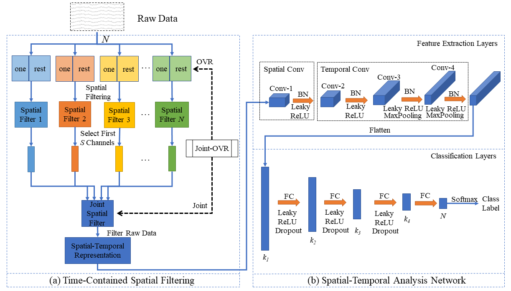

# Joint Spatial and Temporal Features Extraction for Multi-Classification of Motor Imagery EEG

These codes are used for the realization of time-contained spatial filtering and spatial-temporal analysis network (TSF-STAN), and its structure diagram is shown below.

